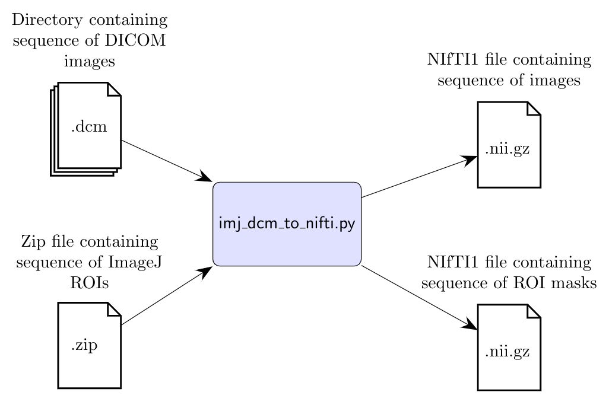
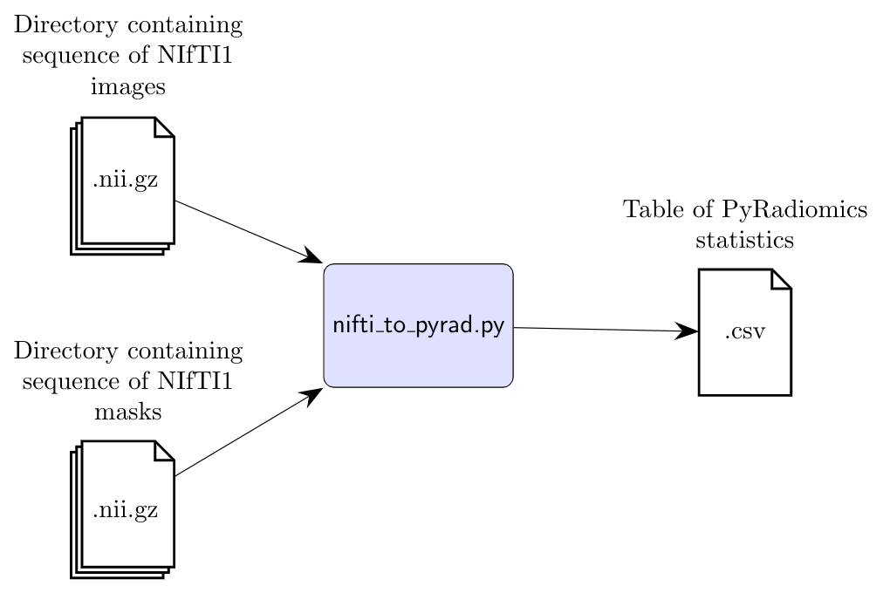

# radiomics-tools

Python snippets for performing radiomics analysis on medical images.  There are currently two operations in this collection:
* imj_dcm_to_nifti.py 
* nifti_to_pyrad.py

#### Disclaimer
No attempt has been made to exhaustively test these tools on a sample of different variations of images and ROIs from different sources.  These are just tools that *we* have developed for our own use on radiomics projects.  These scripts are posted on GitHub not for distribution, but rather just for research transparency and accountability.  But please help yourself, if there's anything in here that you find useful.

### imj_dcm_to_nifti.py

Converts a sequence of ImageJ-drawn[[1]](#1) ROIs on a 3D DICOM image into a pair of NIfTI files: one containing the image and the other containing rasterized masks prepared from the ROIs.

The 3D DICOM image must be presented to the script as a directory containing a sequence of 2D DICOM files.  The ROIs must be contained within a .zip file (exported from ImageJ).  Each of these ROIs is rasterized into a 2d array of 1s and 0s (1s lie in the ROI and 0s lie outside it).  Any images lacking an ROI (there won't necessarily be something interesting on every single slice) are paired with a mask of 0s.  The whole stack of 2D masks is saved as a second NIfTI1 file to accompany the NIfTI1 file containing the image slices.

pydicom[[2]](#2) is used to read the DICOM files, read_roi[[3]](#3) is used to rasterize the ROI contours, NiBabel[[4]](#4) is used to export the masks as NIfTI files and dicom2nifti[[5]](#5) is used to convert the DICOM image files to a NIfTI1 file.

### nifti_to_pyrad.py

*Under construction*

Loads a sequence of 3D NIfTI images and a corresponding sequence of 3D masks into PyRadiomics[[6]](#6).

## References
<a id="1">[1]</a> 
Schneider, C. A., Rasband, W. S., & Eliceiri, K. W. (2012). NIH Image to ImageJ: 25 years of image analysis. Nature Methods, 9(7), 671–675. doi:10.1038/nmeth.2089

<a id="2">[2]</a> 
pydicom

<a id="3">[3]</a>
https://github.com/hadim/read-roi

<a id="4">[4]</a> 
NiBabel

<a id="5">[5]</a> 
https://github.com/icometrix/dicom2nifti

<a id="6">[6]</a> 
van Griethuysen, J. J. M., Fedorov, A., Parmar, C., Hosny, A., Aucoin, N., Narayan, V., Beets-Tan, R. G. H., Fillon-Robin, J. C., Pieper, S., Aerts, H. J. W. L. (2017). Computational Radiomics System to Decode the Radiographic Phenotype. Cancer Research, 77(21), e104–e107. `https://doi.org/10.1158/0008-5472.CAN-17-0339 <https://doi.org/10.1158/0008-5472.CAN-17-0339>
